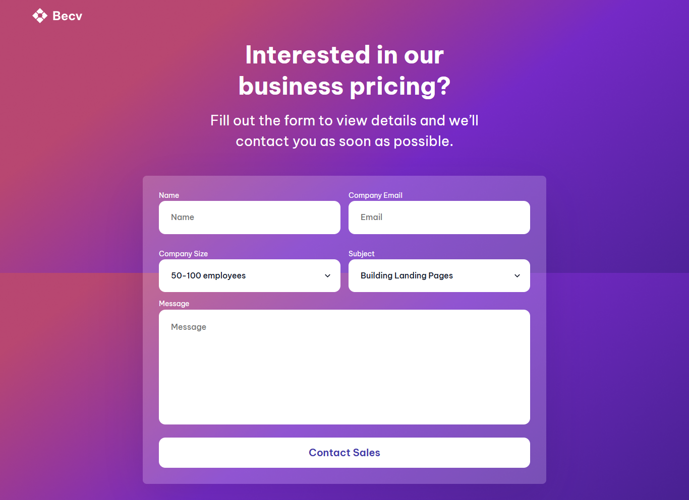

<!-- Please update value in the {}  -->

<h1 align="center">Contact Page Form | devChallenges</h1>

   Solution for a challenge <a href="https://devchallenges.io/challenge/contact-page" target="_blank">Contact Page</a> from <a href="http://devchallenges.io" target="_blank">devChallenges.io</a>.

  <h3>
    <a href="https://gustavo2023.github.io/contact-page-form/">
      Demo
    </a>
     | 
    <a href="https://github.com/gustavo2023/contact-page-form">
      Solution
    </a>
     | 
    <a href="https://devchallenges.io/challenge/contact-page">
      Challenge
    </a>
  </h3>

<!-- TABLE OF CONTENTS -->

## Table of Contents

- [Overview](#overview)
  - [What I learned](#what-i-learned)
- [Built with](#built-with)
- [Features](#features)

<!-- OVERVIEW -->

## Overview

This project is a simple contact form created as a solution for a challenge from devChallenges. The form allows users to input their name, company email, company size, subject, and a message. The design is responsive, ensuring that the form elements adjust to different screen sizes, with two inputs per row on larger screens.

### What I learned

Learned about structuring forms, the different types of inputs and multiple properties of inputs.

### Built with

- Semantic HTML5 markup
- CSS custom properties
- Flexbox

## Features

This application/site was created as a submission to a [DevChallenges](https://devchallenges.io/challenges-dashboard) challenge.

## Author

- GitHub [@gustavo2023](https://github.com/gustavo2023)
